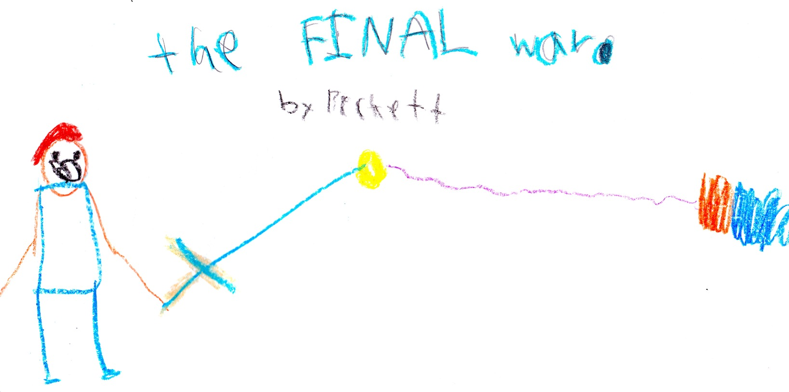
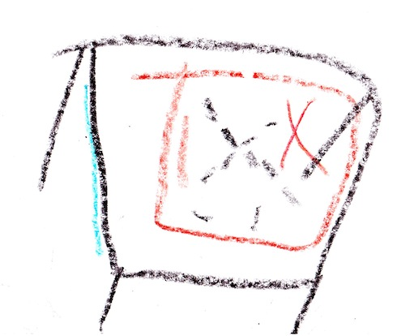
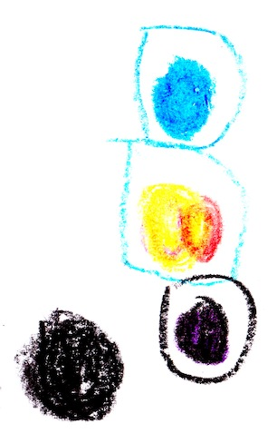
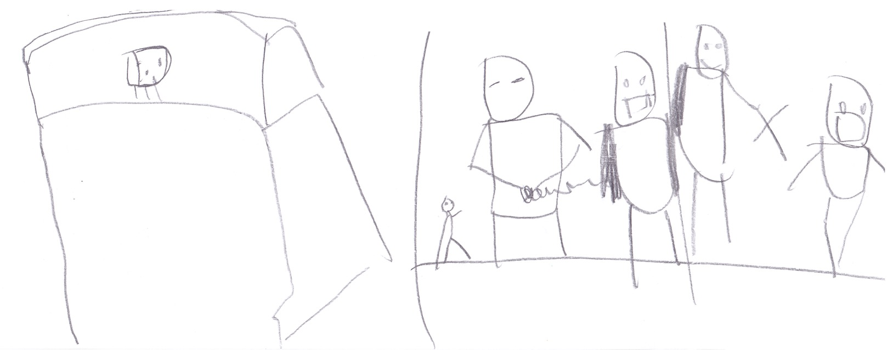
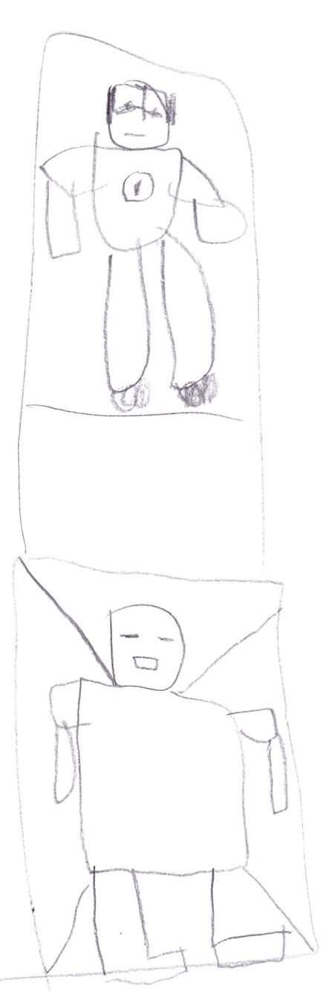
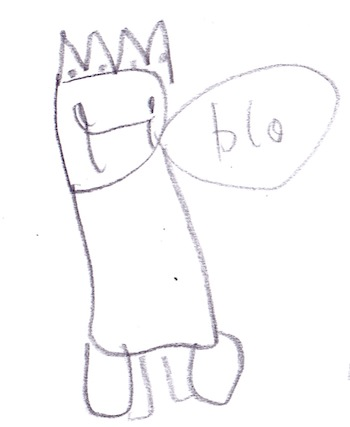
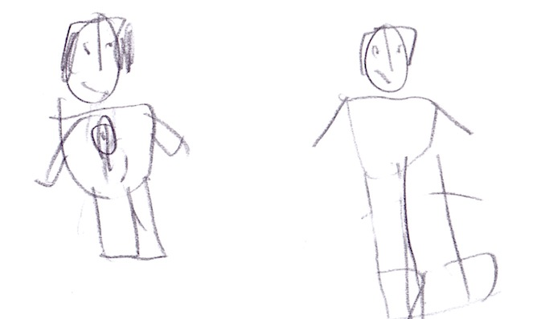
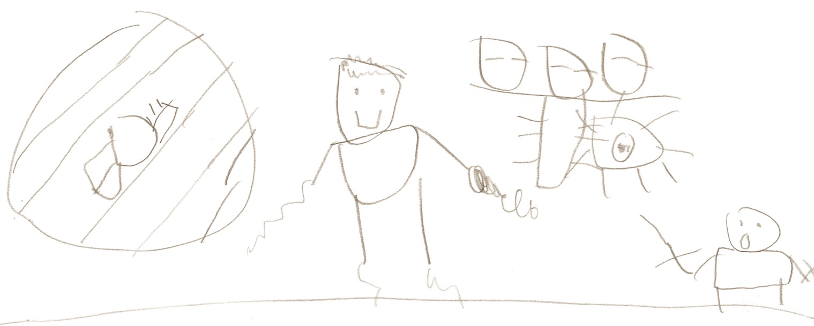

# The Final War

{width=450px}

\clearpage

## He Returns

One day I was exploring when I saw a witch flying down and was heading towards my base! The witch was too fast. She got past the iron golems. I said, “It must be Cindy -- the best witch around!”

She got someone out of prison then Cindy gave him magic. That someone is Herobrine. When I got back they were gone and all of my stuff was gone too! I went to Felix’s house, and said, “Felix?” 

Then Herobrine popped up and said, “I took Felix and blew up your base, and I disabled all portals. Ha, ha, ha!”

***At Herobrine’s base in the End...***

Herobrine was with: 

* Elder the elder guardian,
* Endy the ender dragon,
* Will the wither,
* and Cindy the witch. 

Cindy said, “Finally we got the command block map of power.”

While they were chatting an enderman was listening without permission.

## Should I be good?

It was night and all of Herobrine's endermen were gone. The meeting was over, so an enderman took the map and brought it to me. 

{width=250px}
 

I was starving. The enderman gave me 16 cakes, and I ate three of them. The enderman also gave me the map. I said, “Thanks, but I thought you were bad.”

The enderman said, “I want to be a better enderman, and, by the way, my name is Malek."

{width=500px}
 

***In Herobrine’s base...***

“The map!” Herobrine yelled when he discovered his map was missing. 

***1 hour later...***

Everyone was there to talk about their plan. Herobrine said, 

"Elder, get the water gem!"

"Will, get the fire gem!"

"Endy, get the teleportation gem!"

"Cindy, get the night crystal!"

"And I’ll get the command block. We need all of these to rule the world!”

{width=200px}

## The command block

{width=450px}

Malek and I trained for seven days, and then I went to a village to pass out flyers to every house. The flyers said, "Herobrine is back, and we need help!" The next day a toolsmith named Aden and a weaponsmith named Bob came to help me. We followed the map and when we got to the command block tower Herobrine was going up the stairs. 

Herobrine said, “Malek, why are you working with Beckett?”

Malek said, “I like him better than you!”

Malek teleported us up to the top of the tower where the command block was. Herobrine teleported himself up to the command block also. Herobrine knocked me back, and then fought with Malek. When I got back up, I threw Herobrine off the tower. 

Herobrine said, “Nooooo!”

Malek said, “Great job.”

I said, “The command block runs on magic, Malek. But, I think you’ll die if you give the command block all your magic.”

Malek said, “Remember me when I’m gone,” and gave all his magic away.

I said, “Nooooooooo!”   

And then I said, “I will get Malek and Felix back.”

## The Rescue

“I better keep this safe,” I said. And I put the command block and the other crystals and gems into an undectabale lair. 

***6 Days later...***

Herobrine said, “Welcome back. Did you get it?”

“No,” Cindy said.

Elder said, “I don’t know where it is, but I know that Beckett stole it.”

Herobrine said, “All right, Elder, now I’m going to see if I sense it.” Herobrine used his magical powers to find a powerful crystal. “Nothing,” he said. 

Cindy said, “Maybe it’s the undetectable block.”

***At my base...***

With the crystals safe in an undetectable lair, I teleported to get my friends back. I got Felix out of prison using the teleportation gem. Then the alarm went off. An Enderman army came, but I teleported and got a good magic jar. I dumped the magic on Malek’s dead body. 

Malek woke up and said, “Thank you for saving me.”

That is when I teleported everyone out.

## Herobrine’s Lightning

***In the end...***

The enderman were mining when an enderman found a dark energy crystal. They brought it to Herobrine and he was so pleased. He had all he wanted to make him super powerful, so he did. He got two new superpowers. One of them was dark lightning, the other was teleportation punch.

{width=100px}

***At My Base...***

“Bob, how’s the armor coming?” I said.

“Good,” Bob said. 

A portal opened and Herobrine came out. 

I said, “Ready, Go!” I put on the armor that Bob was making, and then my whole team went out to fight Herobrine. 

{width=450px}

Malek and Bob and Felix finished the battle. I had a big scar on my face. I couldn't get out to battle for a while. 

While I was recovering, Felix led the team. One day Herobrine captured everyone but me. I couldn’t battle, but my friends needed me so I got my sword and went to battle anyway. I eventually won and freed my friends so I was back on the team. 

One day I went to the mineshaft, and I never came back down there. I found stacks of stuff. When I found a secret entrance inside there were tons of creepers. I said,

“Could it be? No way!”

## King Creeper

There -- on a throne -- was King Creeper. He was green and black, wearing a crown on his head, and he had no arms. King Creeper used to be in charge of everything. Now even zombies do not want him. He feels like dying. 

King Creeper said, “I live down here alone with my fellow creepers; not even a zombie needs me.”

I said, “You can be on my team.”

He said, “Do you need me?”

I said, “Yes.”

We left the cave and took King Creeper with his fellow creepers back to our base.

{width=175px}

When we returned to our base, King Creeper told us this story,

“I left the tower to fight players. I ran and ran until I fell into a cave, and I never came out again!”

King Creeper’s fellow creepers didn’t like where this was going. They did not want King Creaper to join the rebellion, so they decided to kill him. They all decided to blow up my base. So they did...**3-2-1-BOOM!!**

## Alex to the Rescue

All of us are hurt then someone came out and saved us. 

Alex said, “Call me Alex.”

Alex built a house and got us back on our feet. 

Unfortunately, the explosion destroyed the undetectable lair. While we were recovering from the blast, Herobrine got all of the crystals. 

He said, “Yes, yes.”

{width=400px}

***Back at Our New Base...***

Herobrine teleported to us as he transformed himself into the most deadliest monster ever. He was invincible except for his eyes. If you touch one of Herobrine’s eyes then all the magic goes out of him. If you touch both of Herobrine’s eyes then he will die.  

Then a portal opened and all of the generals came out. 

{width=450px}

I said, “Let’s fight!”

Felix tried to punch Elder, but Felix was burned by Elder’s laser eyes. 

Malek tried to teleport to Herobrine, but Herobrine was too powerful. “Odd,” Malek said. 

Herobrine said, “All of the magic is mine. Ha, ha, ha.”

## Herobrine’s battle

Alex jumped to Endy, but Endy knocked Alex back. “Ah!” Alex said as she fell down next to Felix and Malek. Now, Bob and I were the only ones not hurt. 

Then all of the bad guys combined their strength to make a giant laser to destroy us. The bad guys shot Bob and me with the laser so we could not battle. 

Next Herobrine tried to take over the world. But when he tried, it didn’t work. 

Herobrine said, “Noooooooo, there’s a lifelock.”

I said, “Ha!”

Herobrine said, “I know the lifelock is in Beckett’s brain,”

Herobrine went into my brain to find memory 57 where the lifelock was stored.

Then Bob said, “The only way to kill Herobrine now is to kill Beckett.”

So Bob killed me so he could kill Herobrine.

As he died, Herobrine said, “Noooooooooo!”

The bad guys were really sad and said, “We lost our leader. We should go home and have a funeral.”

And so the world was saved and everyone recovered, but I was still dead. 

Then all of the crystals said, “Thank you for saving us. As your reward, we will now save Beckett.”

Then I came back to life too, and I said, “Thank you for saving me!”

## The End {-}

Meanwhile, in the Nether someone said,

"It’s my time to raise an army."

**Book 3...coming soon**

