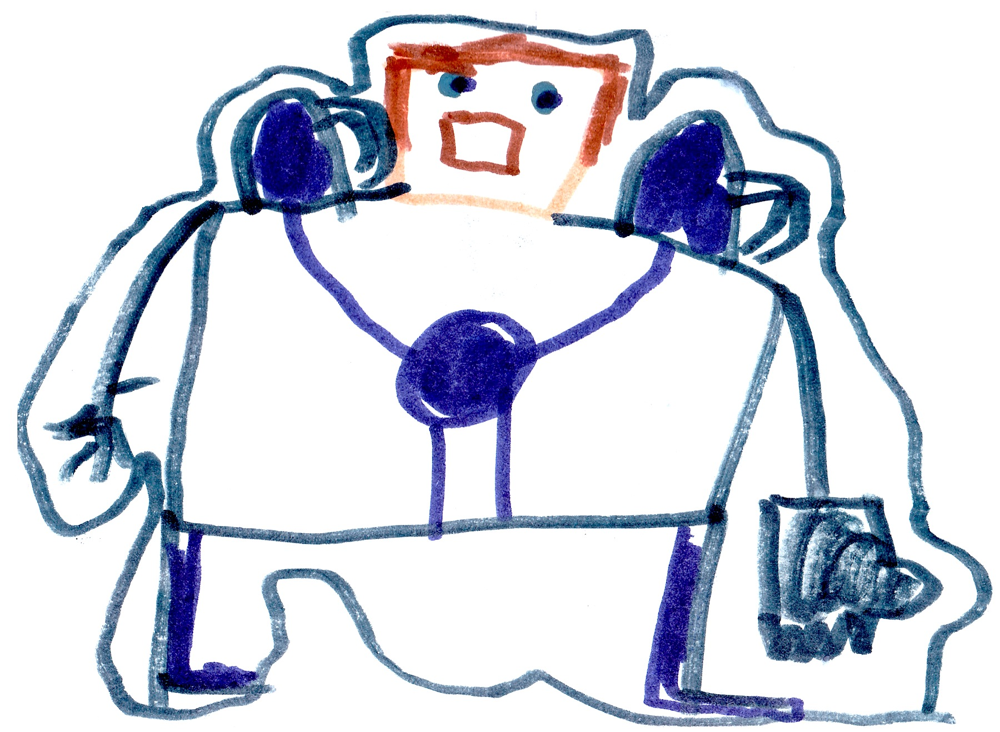

# King Ghast's Revenge

## Rise of a Villain

My team decided to have a victory party for Herobrine's death, but someone had other ideas.

In the Nether...

{width=400px}

King Ghast decided to fight for evil again. He went to The End to find Cindy, the witch, Will, the wither, and Elder, the Elder guardian. He talked about his plan and they said, "With a leader like you, we can win -- you are now Emperor Ghast!"

Meanwhile...

My team had to go to the mine that is close to my destroyed base. I tripped on a rock and fell down to a hidden base made by my dad many years ago. My dad as a ghost appeared and said, "I see you found my lab -- come on let me take you on a tour. On the way Dad said, "I'm sorry for almost killing you. I was turned into Herobrine but now I can remember everything."

I felt sad and said, "I had no idea."

The ghost said, "I fell into a bad magic pool. That's how I become Herobrine."

Dad showed me the library, treasure room and the weapon room. Dad said, "I never powered the weapons." Then I grabbed the command block that I had found at the command block tower during my earlier adventures. "Perfect," Dad said. 

I placed the command block in the missing spot and it worked. The command block powered all the weapons.

## Party!

I left the secret lab and found the party gear I needed in the mine. I went back to my base with the party gear. Three villages joined. We danced, ate, played, and then King Ghast popped out of nowhere. The villages were damaged in King Ghast's attack. Many of the villagers were injured. Boom! Boom!! Boom!!! Booom!!!

{width=500px}

A building had collapsed on Bob. I pulled rocks off and there was Bob. We finished the fight but Bob didn't make it; instead he died. During the fight the bad guys got Herobrine's skull. 

In the end...

{width=300px}

Cindy threw 100 gallons of bad magic on Herobrine's skull. But nothing happened. When Cindy was finished she said, "Come back to me, Herobrine." And then she heard him whisper back, "I will, I will."

## The Fight

A few hours later...

I felt evil getting stronger then a portal opened in the base's front yard, and King Ghast and all his minion ghasts came out. I got 3 weapons from the lab. They were a TNT thrower, a super jumper machine and a super speed machine. I yelled at the ghasts as I shot them, "Get some TNT and you and you. You ghasts all get TNTs." Felix used the jumping machine to jump high and hit the flying Ghasts.

{width=400px}

Aden used the speed machine to make tools, armor, and weapons super fast. I was talking about a plan when...BOOM! I was shot with a bad magic ball and I became evil.

"Give him a good magic jar" said Felix and then threw one on me.

{width=100px} {width=200px}

We eventually scared off King Ghast. 

In the end...

100 bad magic jars were sent by his mining minions to King Ghast, and he decided to experiment with them. He built an energy tracker which tracks energy through other realities. 

Meanwhile...

That night I had a dream that Herobrine was alive, and he was a robot. "Come and get me" he said. I woke up. "What happened?" I wondered. 

{width=300px}

My ghost Dad reappeared and said, "You saw the future". 

"How?" I said. 

I felt as much energy in my body as a time machine has, and I went to bed. The next morning I talked to my friends about Herobrine coming back and no one believed me, but my ghost Dad and Malek.

We thought King Ghast was up to something, so we sent Malek to find out what he was doing.

## Malek's Mission

Malek was sent to spy on King Ghast, and he found a factory and it was making a headless robot. He said, "Is that Herobrine's robot body?"

{width=300px}

At my base...

We went to a farm to to get food. I got food from a cow, but everyone else said the cow was a spy. The cow overheard us talking about Malek and ran away. The cow came to a temple and talked to the slaves to deliver the information that it had learned. It was a spy trained to deliver secret messages.

Malek's trip back to my base took twice as long as usual because he had to avoid all the bad guys who were trying to capture him thanks to the cow spy. Once Malek go back he told me about the important information and data he'd discovered. He had learned that King Ghast's plan was to travel to a different reality. 

## Cindy vs King Ghast

Cindy wanted to get Herobrine back but King Ghast wanted to stay on the throne. Everyone disagreed with King Ghast, so Cindy was now in charge. King Ghast was overthrown. 

Cindy finished Herobrine's robot body and Herobrine's stolen skull was put on. It would take a few hours for him to come back to life. Now Cindy had to distract me so I wouldn't destroy Herobrine before he came back to life. Cindy got Will, Elder, and King Ghast and went to find me.

## The Big Battle

Cindy, Will, Elder, and King Ghast went to find me. When they did find me, I was standing right next to Elder with my sword. KABLAM!!! Elder was dead.

King Ghast was shooting bad magic balls everywhere. I was captured and put in a cage. Then everyone else came out of the base to fight King Ghast and the others. Felix broke me out of the cage, and we all started fighting. The fight lasted for 1 hour and 45 minutes. At the end, all my friends had been captured and put in the cage. I was the only one left. I said, "Bring it on!" Some magic got on my sword from King Ghast's fireball. 

{width=100px}

Luckily that bad magic did not touch my hand, and I used it to kill King Ghast. Will ran away. Suddenly a portal opened and Cindy ran away. I said, "I'm too late!"

{width=100px}

A portal appeared and Herobrine stepped out. He was huge with a robot body and a skull head. On his shoulders were two bad magic jars. Herobrine said, **"I'm back and you won't stop me!"**

