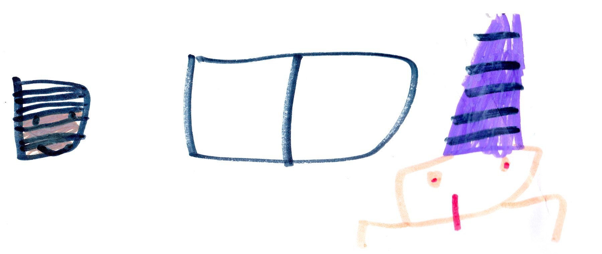
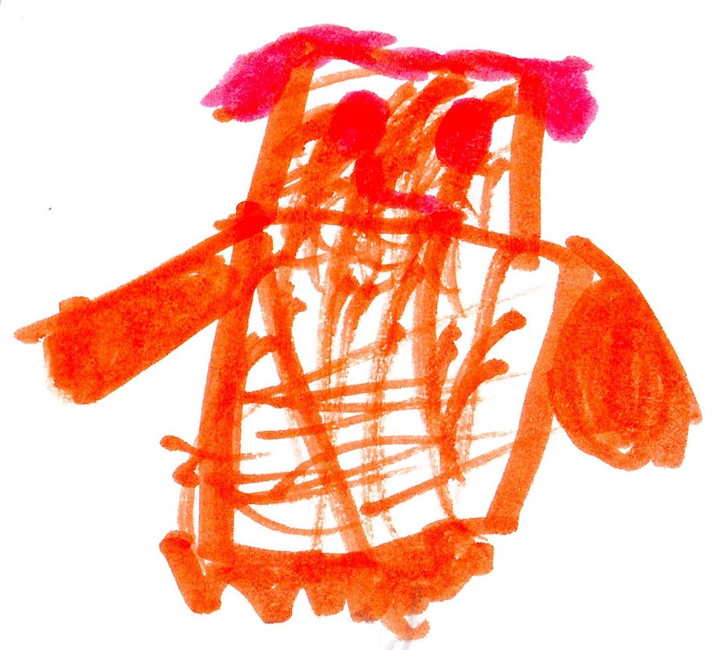
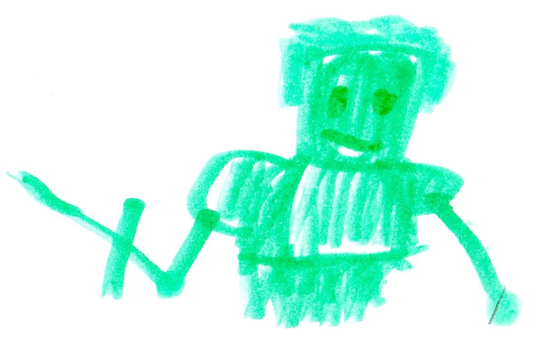

# Herobrine Returns

{width=450px}

\clearpage

## Herobrine Returns

{width=450px}

Herobrine came out and said, “Come and get me!”  I said, ”No.” Herobrine said, “I just wanted you to get a look at me. I will come back in an hour to kill you.”  Then he went away. 

*At my base...*

I said, “Malek, what data did you collect?”  Malek said, “The gems we have can turn us into gods. The bad guys want to get the gems so they can turn into gods.”

*One hour later...*

Herobrine came out of the portal. My team and I got out of my base. The fight was long but at the end I turned into the Life God. That guy's weakness is things that contain good magic like trees, good guys and basically earth. I almost shut off Herobrine but he ran away before I could deactivate him. After that I took a nap. When I woke up I said, “It's time we raid Herobrine's base.”

## We Raid the Base

{width=450px}

Everybody was silent then Malek said, “Are you crazy? That’s impossible! People come in and then die.”  I said, “My grandfather found out and in every End Temple there's a tunnel that leads right to Herobrine's base.” 

*In the tunnel...*

I said, “Our job is to blow up Herobrine's base. While we are inside getting all the information, King Creeper, Alex, and Aden will construct a bomb. When the bomb is finished you come inside and blow up Herobrine’s base.” 

*On Earth...*

Steve Decided to go to the end to see Alex, his wife.

*In the End...*

Malek, Felix, and I got in Herobrine's base. Felix and I got in the vent, and Malek pretended to be a bad guy. I saw Cindy come out of a door and took a picture of her membership card.

*In the bad guy’s base...*

Felix was in a fight with Will. When the fight ended, Felix was put in prison.

*In the tunnel...*

Aden, King Creeper, and Alex were almost done, but a sinkhole opened, and Aiden and the bomb fell Down. Aden died. 
*In the bad guy’s base...*

Malek accidentally found Will who said, “Malek? Is it really you? Guards, get him!” Malek said, “I knew this was a bad idea”. Malek was put in prison.

*In the tunnel...*

Sinkholes were everywhere. Alex saw Steve, and Steve made a portal. Alex and Steve went back to Earth. Eventually King creeper made it to Herobrine’s base. He freed Malek and Felix. King creeper called me and said, “Time to blow up the base!” I said, ”But there's no bomb you will have to blow yourself up.” King Creeper said, “Then that's what I'll do,” and everyone got out. King Creeper exploded but did not come back to life. I started to cry. I felt like my team was falling apart, but also I had to stay sharp.

## The Bad Guy Survival on Earth

{width=450px}

It would take a year to fix the base in the End. After the base was destroyed, Herobrine put his base on Earth. Since Herobrine has never lived on earth it was hard to survive. Herobrine was always mad on Earth. 

One day Cindy was sent to the mines. Cindy found our Mineshaft and went inside. She found a door and opened it. Inside was where we found King Creeper but this time it was all decorated with zombie decorations. Cindy looked  around and then she heard someone say in a deep voice, “Cindy, I was looking for you.” Cindy said, “King Zombie!”

## The Battle of Our Lives

{width=250px}

Herobrine left King Zombie in charge while he fought me. He took Cindy, Will, and the army of Enderman to our base. When Herobrine got to my base, he said, “Come out Beckett.” I said, “Everyone come out.” Then I said, “This is a job for the Life God.” When I turned into the Life God there was a force field that things with bad magic can't go through. When everyone came out I said, “Everyone fight Herobrine's Enderman, and I'll fight Herobrine.”

*One hour later...*

I said, “We are losing the battle.” The Villagers saw and decided to help. I said, “The villagers were saved. Now it is just us and Herobrine.” 

## Herobrine and Us

{width=250px}

Our team thought we had the advantage but we were wrong. Soon everybody was hurt but me. It was because of my life shield. I said, “Guys we can't give up.” Then I saw the Fire Gem fly   towards Felix. Then Felix turned into the Fire God. Felix and I fought Herobrine but Felix wasn't used to his power so after a while he would lose his power. As soon as Felix lost his power Herobrine picked up the Fire Gem and said, “Yes...more...MORE!”  as he turned into the Fire God.

I called Everyone else and said, “Help!” Everyone came. Then a portal opened. I said, “Steve, I was wondering where the Magic Gem was, and now I know you are the magic god.” he hit Herobrine but it didn't do a dent. Then Herobrine got his power too. The magic got turned back into Steve. Herobrine destroyed Malek and hope was lost. The fight went on at the end. Herobrine punched me so hard that I turned back into a human. But Herobrine couldn't find the Life Gem, so he got the life lock key from our base instead. 
Herobrine had won. 

## The New World 

{width=250px}

Felix was in a secret base when the door opened. Malek said, “Herobrine destroyed the last town.” Felix said, “Herobrine got the life lock key and killed Beckett; now he has the upper hand.” 

*At the bad guys base...*

Herobrine said, “It has been a year since I killed Beckett and I still can't find the Life Gem.” I hid it  in my palm. Suddenly, I came back to life as the Life God. I said, “The Life Gem must have turned me alive again.” I went back to Felix's  base and found Felix. We talked and talked, and then I said, “That’s it! I'll talk to Cindy and Will and see if they want to take down Herobrine.” 

## Will or Will Not

*In the Nether...*

Will and Cindy were playing when I came. Will said, “What do you want?”  I said, “Herobrine is destroying our land.” Will said, “Herobrine is destroying the Nether, too.”  I said, “Then let's stop Herobrine once and for all!”

Cindy and I will team up to the destroy Herobrine. Cindy took off her mask. I said, “Mom?”  Cindy said, “Yes, Herobrine forced me to give up all good and take on this disguise, or else I would die.”  Then Mom got the Water Gem turned into the water God.  

## The Last War

{width=100px}
{width=30px}
{width=100px}
{width=100px}
{width=100px}

Malek turned into the night God. I got my life sword; Malek got his night arrows and a night bow; and Mom got the ice machine. Suddenly Herobrine came out of a portal. Will said, “Herobrine, you boss  us around too much, now it's time for you to die.”

After a while Will destroyed his own heart -- the Nether Star -- to save us all. Will’s death caused Herobrine to lose the Fire Gem. Felix got the Fire Gem and turned into the Fire God. 

Eventually all of us were not able to fight. Dad as a ghost possessed me and fought Herobrine.  Felix said, “Wow, I never knew dad was so strong.”  But Herobrine still took Dad down. Then I had an idea.  

I fought for a while and then shut my eyes. Felix said, “Don't do it!”  Herobrine tried to punch me. I dodged it. Herobrine said, “What? He had his eyes closed.” After a while I open my eyes and threw a magic ball at Herobrine. Herobrine fell, and I cut his head to pieces. My team got the life lock key and saved the world. 

From that day on we were called...

**WORLD'S DEFENDERS**

