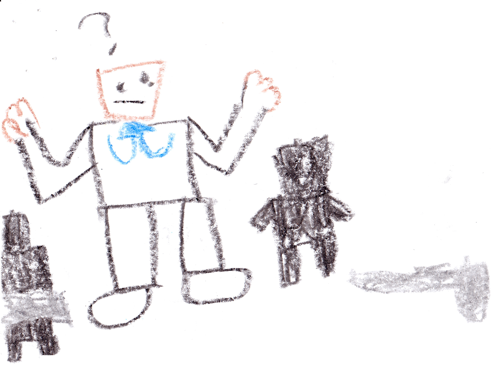
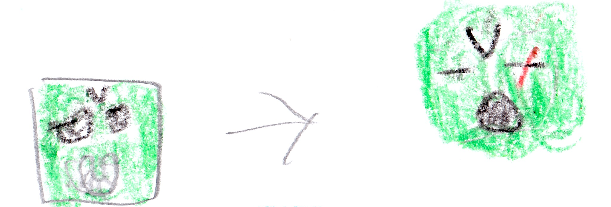

# The Four Bad Guys

## Malek's old friend

{width=450px}

Someone was running. Someone was panicking. His name was Ender. He led a company called the "E.N.D. Spies". Their job was to spy on bad guys, but right now he was being hunted and he was running because End Bot and three hunters were chasing him. Ender ran so fast that the bad guys didn't know where he went. Soon Ender came to an electric fence protecting our base.  Ender said, "Let me in! Let me in!” There was a security camera. I saw him over the security camera.  I said, "Malik you have to see this." Malik came and said, "That's Ender! Let him in!!"  I did.  We closed the door. When the three bad guys arrived, Alex put up the defenses. The bad guy in the middle said, "You don't scare ...!"

Then, Clank!!! The other two bad guys dropped their weapons and ran away. "AAAAAAAAAAAA!!!!!!" screamed the other bad guy as he ran away. "That was easy," said  Ender. "Now tell us why you're here," I said. "I will," said Ender.

## Ender’s story

{width=450px}

Everybody found a seat and sat down. 

I said, "Ender, I want to hear your backstory. What brought you here?" 

Ender said, "Well first, I made a network of undercover spies from The End. We call ourselves the E.N.D. Spies, and we infiltrated the bad guy gang. We know that Malek likes to spy on other bad guys." 

"Wait you did?" asked Malek. 

"We did. One day a bad guy named Armstrong figured out that Malek likes to spy on other bad guys. Armstrong ordered me to destroy Malek, but we escaped and blew up the base instead. Every bad guy died except Armstrong. Somehow Armstrong survived but he could no longer see out of his left eye, and he lost feeling in his right arm. His eye and arm were replaced with robot parts. Ever since that day all of our bases have been hunted. I am the only Survivor."

Ender started to cry. I said, "Ender I'm sorry you can live with us." Felix said, "Beckett are you sure?"

"Yes I'm sure," I said.

## Two villains

{width=450px}

After Herobrine Returns (the previous book) King Zombie took control of the bad guys. He was trying to find more leaders to help him. He was looking for a witch named Ave that helped him a long, long, long, time ago. He sent End Bot and his helpers to look for her. Just then -- Ding dong.

"Who is it?" King Zombie asked.

"It's me, Ave.”

"Come in," said King Zombie.

Ave walked in and said, "It's good to be back.” 

"Ave, you are now a boss for the bad guys. Step closer to receive your red violet badge and your black armor," said King Zombie.

Ave stepped closer and got her stuff. Then Commander Rip said, "King Zombie you have to see this!"

They looked out the window to see someone flying toward the gate. It was Endy.

## Endy

There was Endy the Ender Dragon. King zombie said, "Open the gate, and let Endy in." 

He landed outside the door. King Zombie ran out and said, "Endy, what brings you here?" 

Endy said with a growl, "I want to see a Ave!!!"  

Just then Ave ran out the door. Endy said, "Two years ago King Ghast took control of all the bad guys. I knew that the bad guys were going to die, so I quit, and I promised to return when I would be needed. I woke up today with a plan. Ave, use your powers to make me stronger, faster, and more evil." 

"Sure,” Ave said pleased.

## The Power!!!

{width=200px}

Ave called three more witches. Ave commanded, "Look in page 61 of The Witch Spells."

They found it and looked at the blueprint. The blueprint looked like this:

They got ready to do the spell. 

Ave said to Endy, "This really hurts a lot -- remember that." 

Endy said, "Start," so they did. 

Endy screamed as he felt himself getting stronger and stronger and stronger. Soon his eyes turned red, and then the witches stopped. 

"How do you feel Endy?" asked Ave. 

"Ha-ha, perfect!" said Endy in an evil voice.

{width=450px}

## Our cool spaceships

{width=450px}

*Meanwhile at my base...*

"I'm  done!!!" Alex said. We ran over. It was a spaceship for the Water, Fire, Night, and Life Gods. 

"Wow!" Everybody said. 

Alex said, "Oh that's nothing. come with me." My team walked down the hall and walked in a door and saw a big battleship. 

"What!!!" Everybody screamed. 

"I'm still working on it. It should be done by the end of this book," Alex said.  

I said, "Don't spoil the book.” 

Beep! beep! beep! 

"It's time for me to go on patrol. Bye everybody see you soon," I said. I got into the amazing Life Ship and flew away. 

Then, Ender came back from his time spying on the bad guys and said, "Where's Beckett?!?" 

"Oh, he just went on Patrol." 

"No," said Ender. 

"What?" asked Felix. 

Ender said, "Beckett is going to be..."

### The plan

Sorry that I had to interrupt that chapter but there is something I need to tell you:

*15 minutes earlier...*

The bad guy set up a meeting. King zombie said, "Endy, you said you had a plan."

"Yes," said Endy, "Instead of fighting Beckett’s whole team we will just fight Beckett. Then we will fight the rest of the team. Then we will suck the Life Gem's magic and use it to take over. Ha-ha-ha!"

"Great idea. To keep the good guys busy I will send Commander Armstrong," King Zombie said. He called Commander Armstrong and sent him to my base. Ender, who was spying, saw this all and ran away.

### Our cool spaceships (in progress)

...Hunted by Endy the Ender Dragon, King Zombie, and Ave the Witch! We need to find him and fast!!"

Everybody ran to their space ships. Alex opened the door when...

ZZZAP!!!! A blue ray shot down. Alex closed the door before it got inside. 

"Who did that?!?” Alex asked herself.

## Armstrong

Ender ran to the camera. He said,” Armstrong! he did that!”  

Armstrong flew over our base in his spaceship. Suddenly arms came out of the spaceship. One arm was holding a machine called “The Hypnotizer”

Meanwhile, I was being chased by Endy, Ave and King Zombie. Suddenly a slot opened in my Life Ship that was the same shape as the Life Sword. So I put the Life Sword in. Just then a giant sword formed on top of my spaceship. “Perfect.” I said. 

I fought the bad guys but they continued chased me. 

Meanwhile, Armstrong was attacking Felix, Malik, Alex, Mom, and Ender.Felix, Malek and Mom were flying their spaceships.  Alex and Ender were inside my base launching cannon balls. Armstrong hit the base with his Hypnotizer and everyone inside got hypnotized (Alex and Ender). Next he hit Mom and then Malek. Then in Felix's Fire Ship a slot openned to put the fireball shooter in. Felix did. Suddenly, a huge fireball shooter formed on top of Felix’s Fire Ship. Felix pressed the button and the fireball shooter shot a fireball. It hit the bad guys' spaceship, and it crashed, but Armstrong escaped. 

Meanwhile the bad guys were still chasing me. They were right above me and sucked me in with a tractor beam. 

"Oh no.” I said sadly.

## Captured

{width=400px}

They put me in a cell in their space ship. 

"Set a course for Beckett’s base," King Zombie said. 

I was sitting in my cell when I heard a voice. "Beckett -- it's me the Life Gem. I'm very proud that you...AAAAAAAAAAAAA!!!""

I heard Ave from outside the cell door, "I successfully sucked the magic out of the Life Gem." 

I put my head down I started to cry. "No," I said. But I felt like he was still alive, and he was. 

You see, the Life Gem was being recharged by me. I didn't know how at the time, but eventually the tank was holding too much magic and got too full and shut down Ave's magic-sucking contraption. The Life Gem got free. It hopped to me and then I turned into the Life God and said, "I look different." 

The Life Gem said, "That means you can shoot a tree out of your hand."

"Cool!" I said.

Then I cut the bars using my Life Sword. Then I ran to docking area and climbed into my Life Ship. Then I formed the Life Sword on top of my Life Ship and cut the spaceship and flew out of the hole. The bad guys' space ship crashed in front of my base.

## Big fight

{width=450px}

King Zombie crashed. When he woke up he saw Felix.

"Well, well, well, look who's here," King Zombie said.

"I am here to finish the job -- soon you will be no more," said Felix. 

Felix turned into the Fire God. King Zombie got out his fire sword. They fought. Felix wasn't getting anywhere but he was dodging all King Zombie's attacks. Then he formed the fireball shooter and shot fireballs. King Zombie dodged all of these. But one of them hit his sword. Felix kept firing more and more fireballs at King Zombie's sword. Then the fire sword flew out of King Zombie's hands. "No!" King Zombie said. Felix and King Zombie raced to get the sword. Felix got it first. Then he slashed King Zombie's head, but King Zombie survived. Felix said, "I win," and he walked away. 

Ave came and helped King Zombie up. Armstrong, Ave, and King Zombie went away. But Endy stayed to finish the job 

## Endy’s last breath

Mom said, "Malek and I will chase King Zombie, Ave, and Armstrong. Felix and Beckett will defeat Endy." Then Mom and Malek ran away. Felix and I got in our spaceships and started fighting Endy. But Endy was faster than our spaceships. He could heal very fast, and he was very, very strong. Endy hit our spaceships so hard with his tail our spaceships fell to the ground. 

"Oh no!" I said. 

"It is all over!" said Felix. 

Then we heard this: "Screech!!!!"

{width=450px}

A few seconds later we saw Alex's big battleship! 

Alex said, "I told you it would be ready at the end of this book. Now, let's go fight Endy." 

I said, "Okay!" 

Endy attacked but he could hardly make a dent in Alex's new ship before he got hurt. Endy was so distracted by the battleship that he didn't see me in my spaceship. I formed the sword on top of my spaceship and I slashed Endy with it. Eventually Endy fell to the ground. When the dust cleared Endy was no more.

## The portal

{width=400px}

A few hours later, Ave said, "We may have lost Endy but we still have tons of Life Gem magic -- more than I ever thought was possible. I think I can build a portal that will send the good guys galaxies away." So that's what she did. 

*Four days later...*

Ave launched the portal. We saw the portal, and we knew it was Ave's handywork. The portal began sucking up all the local villagers. We jumped in our spaceships to destroy the portal. It was a hard fight. At the end, the portal was going to suck up the gods. From a distance Ave was shooting pulse arrows. These arrows suck up magic. Felix, Malek, Alex, Mom, and I were all being sucked closer to the portal. Then a turbo switch opened on Felix's dashboard. Felix pressed the button and got free of the portal's grip. But then Felix heard me say, "Goodbye Felix." 

Alex, Malek, Mom, and I were all sucked in. 

Felix said, "No!" Felix started to cry. He had no idea what he was going to do next.

## The end

Sorry there will be no more books in this series. No more not at all!

Who am I kidding? I will make tons more! 

So find out where I am in my next book:

 

**TWO ADVENTURES**

 

*Book 6 about my adventures in a video game named Minecraft.*

